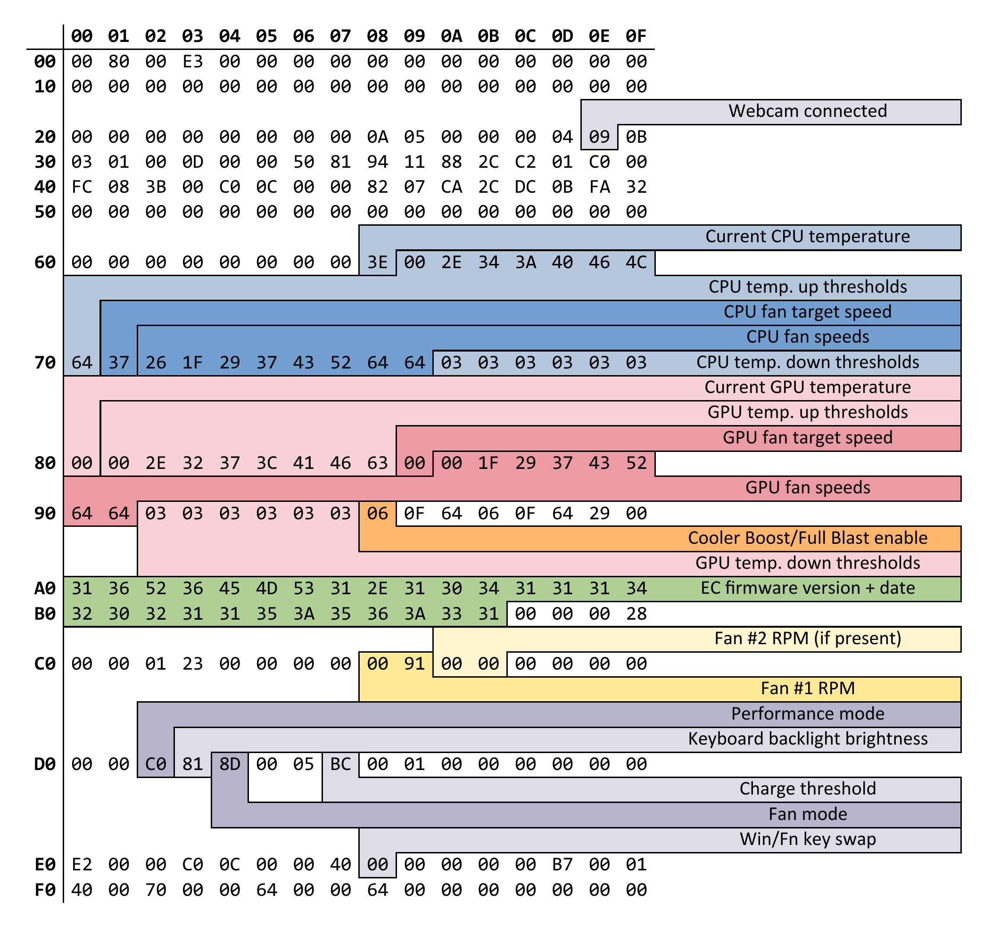

# MSI EC Research

This document describes some of the registers and their functions in the EC
(Embedded Controller) of the 10th-gen and later Intel MSI laptops.

I used MSI Center, [NoteBook FanControl](https://github.com/hirschmann/nbfc)'s
`ec-probe` utility, and [this image](https://github.com/YoyPa/isw/raw/master/wiki/msi%20ec.png),
from YoyPa's [Ice-Sealed Wyvern](https://github.com/YoyPa/isw/) (a fan control
utility for MSI laptops running Linux) to reverse-engineer these registers.

Any registers not listed here are either unused or have an unknown function.

Provided below is a dump of the GF63 Thin 11SC's EC registers you can use for reference:

## `0x2E`

Controls whether the webcam is enabled (0x0B) or disabled (0x09).

This value is updated when using the keyboard shortcut (if present) to toggle
the webcam.

## `0x2F`

Controls whether the webcam can be enabled using the keyboard shortcut or by
writing to `0x2E`. A value of `0x0B` means "unlocked", and `0x09` means "locked".

The value at `0x2E` is not affected by writing to this register.

## `0x68`

Stores the realtime CPU temperature (in °C).

## `0x69..0x70`

Stores the temperature up thresholds for the CPU fan profile.

`0x69` should always be 0°C, as this register appears to be tied to register
`0x72`, which stores the default/lowest fan speed.

`0x70` appears to not have its own corresponding down threshold, and is set
to `0x64` (100°C) by default.

`0x69` and `0x70` are not controlled by MSI Fan Control, and are left at their
default values of `0x00` and `0x64` (0°C and 100°C).

See also [`0x72..0x78`](#0x720x78).

## `0x71`

Stores the realtime CPU fan speed target (from 0-100%).

### Note:

Although MSI Center allows setting fan speeds of up to 150%, values
above 100% do not appear to speed up the fan any further on the GF63 Thin 11SC
(which only has one fan for both the CPU and GPU).

## `0x72..0x79`

Stores the fan curve for the CPU fan profile.

`0x79` appears to be tied to `0x70`, which doesn't appear to have its own
temperature down threshold. This value is also set to `0x64` (100% fan speed)
by default, and is not controlled by MSI Fan Control.

See also [`0x69..0x70`](#0x690x70).

## `0x7A..0x7F`

Stores the CPU fan down thresholds. The down thresholds are calculated as
follows: `down_threshold = up_threshold - value`, where `value` is the value
stored in the register.

This feature is not used in MSI Center, and was found by testing different
values from the defaults and observing the results.

## `0x80`

*Note: Registers containing GPU fan settings are ignored on laptops with no discrete graphics.*

Stores the GPU temperature (in °C). This will be 0 if the GPU is not currently
being used.

## `0x81..0x88`

Stores the temperature up thresholds for the CPU fan profile.

`0x81` should always be 0°C, as this register appears to be tied to register
`0x8A`, which stores the default/lowest fan speed.

`0x88` appears to not have its own corresponding down threshold, and is set
to `0x64` (100°C) by default.

`0x81` and `0x8A` are not controlled by MSI Fan Control, and are left at their
default values of `0x00` and `0x64` (0°C and 100°C).

See also [`0x8A..0x90`](#0x8a0x90).

## `0x89`

Stores the current GPU fan speed target (from 0-100%).

## `0x8A..0x91`

Stores the fan curve for the GPU fan profile.

`0x91` appears to be tied to `0x88`, which doesn't appear to have its own
temperature down threshold. This value is also set to `0x64` (100% fan speed)
by default.

See also [`0x81..0x88`](#0x810x88).

## `0x92..0x97`

Stores the GPU fan down thresholds. The down thresholds are calculated as
follows: `down_threshold = up_threshold - value`, where `value` is the value
stored in the register.

## `0x98`

Enables (0x86) or disables (0x06) the Cooler Boost function. This sets all fans
to full blast while enabled.

In YAMDCC, this option is called "Full Blast".

## `0xA0..0xBC`

Contains the EC firmware version (first 10 bytes) and date (last 16 bytes).

The date is stored in the following format: `MMDDYYYYHH:mm:ss`, i.e. US date
format without separators + 24-hour time string (with no separator between date
and time).

As of the time of writing, my GF63 Thin 11SC produces the following strings:

More information on EC firmware version strings is available
[here](https://github.com/BeardOverflow/msi-ec/blob/main/docs/device_support_guide.md#firmware-naming).

EC firmware version: `16R6EMS1.104`
EC firmware date: `1114202115:56:31` -> 14/11/2021 at 3:56:31 PM

## `0xC8..0xC9`

Stores the Fan RPM as a 16-bit unsigned integer (big-endian). The actual fan
RPM can be calculated with `RPM = 478000 / value`.

### Note:

If you are trying to make a config for your laptop, this set of registers may
be in a slightly different location (or multiple locations, for laptops with
more than one fan). For example, on the MSI GS40 6QE, the fan RPMs are stored
at `0xCA..0xCB` for the GPU fan and `0xCC..0xCD` for the CPU fan.

## `0xD2`

Controls the performance level of the laptop:

- `0xC4`: Turbo. The `MSI GF63 Thin 11SC.xml` config sets this value when loaded.
- `0xC0`: High
- `0xC1`: Medium (default on my machine). Causes maximum fan speeds to be capped at 60% (~3500 RPM).
- `0xC2`: Low:
  - Limits CPU power draw to 10W while active (but not the dGPU power draw, funnily enough).
  - Modifys some fan settings. This is still being studied, but appears to completely mess up
    custom fan curves.

## `0xD3`

Controls the keyboard backlight. The brightness level can be set using
`0x80 + brightness`. Possible brightnesses are `0x80` to `0x83`
(off, low, med, high).

## `0xD4`

Appears to change some fan control setting, must be written to `0x4D` for fan
control curve to be applied correctly (Default: `0x0D`)

## `0xD7`

Controls the battery charging threshold. The laptop battery will stop charging
when it reaches the threshold, and will wait until it drops 10% below the
threshold (e.g. if set to 80%, battery will stop charging at 80% and will only
start charging again when it reaches 70%).

The default value is `0x80` (128), which disables the charging threshold
(battery will always charge to 100% when plugged in).

## `0xE8`

Controls whether the Win and Fn keys are swapped. `0x10` means enabled, and `0x00` means disabled.

([Source](https://github.com/BeardOverflow/msi-ec/blob/853ffe3dc74f4dea1e0daeafed1a4562b4bf0130/msi-ec.c#L1036).
I know it's for a different laptop, but this works on my machine as well)

## `0xEB`

Unknown, but this register seems to be tied to `0xD2`, as `0xEB` gets set to
`0x0F` when `0xD2` is set to `0xC2` (Low Performance level), otherwise it's
set to `0x00`.
