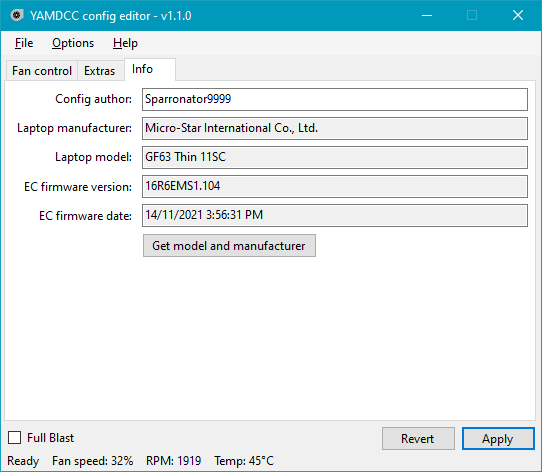

# YAMDCC - Yet Another MSI (Dragon) Center Clone

A fast, lightweight MSI Center alternative and fan control utility for MSI laptops.

**Please read the whole README (or at least the [Supported Laptops](#supported-laptops)**
**and [FAQ](#faq) sections) before downloading.**

Table of contents <i>(click to expand</i>)

- [Disclaimers](#disclaimers)
- [Features](#features)
- [Screenshots](#screenshots)
- [Supported laptops](#supported-laptops)
  - [Community-tested laptops](#community-tested-laptops)
- [Comparison](#comparison)
- [Roadmap](#roadmap)
- [Download](#download)
- [Compile](#compile)
- [Issues](#issues)
- [Contributing](#contributing)
- [FAQ](#faq)
- [License and copyright](#license-and-copyright)
- [Third-party libraries](#third-party-libraries)

## Disclaimers

- This program requires low-level access to some of your computer hardware to
  apply settings. While no issues should arise from this, **I (Sparronator9999)**
  **and any other contributers shall not be held responsible if this program**
  **fries your computer.**
- Additionally, if you do something silly with the program like turn off all
  your fans while running under full load, **we *will not* be held responsible**
  **for *any* damage you cause to your own hardware from your use of this program.**
- Linux is not yet supported. Please don't beg me for Linux support, it will
  come when I can be bothered (and when I figure out how to run background
  services/daemons on Linux).
- This program, repository and its authors are not affiliated with Micro-Star
  International Co., Ltd. in any way, shape, or form.

## Features

- **Fan control:** Change the fan curves for your CPU and GPU fans, including
  fan speeds, temperature thresholds, and Full Blast (a.k.a. Cooler Boost in
  MSI Center). This allows you to fix a curve that is not aggressive enough
  under full load, turn your fans off when your computer is idle, or just give
  them a boost during CPU-heavy tasks.
- **Performance mode:** MSI laptops have their own performance mode setting
  (not to be confused with Windows' built-in power plans). You can change it here.
- **Charging threshold:** This program can limit how much your laptop's battery
  charges to, which can help reduce battery degradation, especially if you
  leave your laptop plugged in all the time.
- **Lightweight:** YAMDCC takes up less than two megabytes of disk space when
  installed, and is designed to be light on your laptop's CPU.
- **Configurable:** Almost all settings (including those not accessible through
  the config editor) can be changed with the power of XML.

## Screenshots

## Supported Laptops

Currently, there are configs for the following laptops:

  - MSI Alpha 17 C7VF (thanks @SethCodingInc)
  - MSI Bravo 15 B7ED (thanks @VisionCrizzal)
  - MSI Crosshair 17 B12UGZ (thanks @ios7jbpro)
  - MSI GF63 Thin 11SC
  - MSI Katana GF66 12UG (thanks @porkmanager)
  - MSI Modern 15 A5M (thanks @tedomi2705)
  - MSI Titan GT77HX 13VH (thanks @noteMASTER11)

There are also generic configs that should work with most MSI laptops, but with
an incorrect default config. You can use the EC-to-config feature to get the
proper fan curves for your laptop, then [create a pull request](https://github.com/Sparronator9999/YAMDCC/pulls)
to get your laptop's config added to the project.

Other laptop brands are not officially supported. You can still try and
[make your own config](https://github.com/Sparronator9999/YAMDCC/wiki/How-to-make-a-config-for-YAMDCC#manually-from-scratch),
but chances are you're looking for [NoteBook FanControl](https://github.com/UraniumDonut/nbfc-revive) instead.

### Community-tested laptops

The following laptops have been tested by the community and are confirmed to be
working, but don't have their own public YAMDCC configs. A suggested generic
config is provided below:

- MSI Raider GE66 12UGS (thanks @grimy400): `MSI-10th-gen-or-newer-dualfan.xml`
- MSI Vector 17 HX A14VHG (thanks @injitools): `MSI-10th-gen-or-newer-dualfan-nokeylight.xml`
- MSI Vector GP78 HX 13V (thanks @Twisted6): `MSI-10th-gen-or-newer-dualfan.xml`

To test your laptop, go to the [config tutorial](https://github.com/Sparronator9999/YAMDCC/wiki/How-to-make-a-config-for-YAMDCC)
wiki page and follow the instructions to get a config for your laptop.

## Comparison

| Feature                         | MSI Center | YAMDCC      |
|---------------------------------|------------|-------------|
| Installed size                  | ~950 MB²   | ~2.5 MB²    |
| Fan control                     | ✔          | ✔           |
| Temp. threshold control         | ❌          | ✔           |
| Multi-fan profile support       | ❌          | ✔           |
| Charge threshold setting        | Limited³   | ✔           |
| Perf. mode setting              | ✔          | ✔           |
| Win/Fn key swap¹                | ✔          | ✔           |
| Win key disable                 | ✔          | ❌           |
| Keyboard backlight adjustment¹  | ❌          | ✔           |
| Hardware monitoring             | ✔          | Limited⁴    |
| Other MSI Center features       | ✔          | ❌           |
| Open source                     | ❌          | ✔           |

1: Support for this feature depends on the specific MSI laptop model and YAMDCC
support.

2: As of v2.0.38, MSI Center takes about 950 MB of storage space when counting
the UWP app (749 MB) and the files installed on first launch to
`C:\Program Files (x86)\MSI` (205 MB). YAMDCC's installed size is based on the
Release build of [v1.0](https://github.com/Sparronator9999/YAMDCC/releases/tag/v1.0.0),
and includes all unzipped program files and included config XMLs.

3: MSI Center only supports setting the charge threshold to 60%, 80%, or 100%,
while YAMDCC can set this to anything between 0 and 100% (with 0 meaning charge
to 100% always).

4: YAMDCC only supports monitoring the CPU/GPU temperatures and fan speeds via EC.

## Roadmap

The following features are currently planned for v1.1:

- [ ] Hotkey support ([#22](https://github.com/Sparronator9999/YAMDCC/issues/22)) *(in progress)*
  - This will be a separate background program that stays in the system tray
    and listens to keyboard shortcuts.
- [x] Switch fan profiles on performance mode setting adjustment
      ([#37](https://github.com/Sparronator9999/YAMDCC/issues/37))

Below are some planned features for potential future releases:

- [ ] CLI support
  - Development of a CLI application for YAMDCC has started, but isn't publicly
    available yet
    - The CLI is missing a *lot* of features, and could do with a rewrite.
- [ ] GPU switch support *(currently being researched)*
- [ ] Support for editing laptop config registers using the GUI/CLI
  - This would allow for creating configs for other laptop brands from the
    config UI
  - Currently, the only way to do this is to edit the XML directly.
- [ ] Plugin system for additional optional features *(needs research)*
- [ ] Re-work install experience
  - Currently the Config Editor handles managing service installation, but this
    should probably be done in an installer/separate application.
- [ ] Support for keyboard mic/speaker mute LEDs
  - Apparently this isn't handled by hardware/Windows, but after
    [reverse-engineering Apple's Boot Camp](https://github.com/Sparronator9999/OpenBootCamp)
    to get keyboard shortcuts working without it, I really shouldn't be
    surprised anymore.
- [ ] .NET support
  - Mandatory for Linux support
  - The GUI *should* compile on .NET 8 (and in fact *has* been compiled on .NET 8 before).
  - The Windows service on the other hand... is going to be interesting. Even
    with the `Microsoft.Windows.Compatibility` package installed, I still
    wasn't able to get the service to run without issues.
- [ ] Linux support *(not guaranteed)*
  - Now this would require some figuring out, and may end up being a seperate
    project that's compatible with this project's configs.

## Download

Beta builds are available from [GitHub releases](https://github.com/Sparronator9999/YAMDCC/releases).

Development builds are available through [GitHub Actions](https://github.com/Sparronator9999/YAMDCC/actions).

If you don't have a GitHub account, you can also download the latest development build from
[nightly.link](https://nightly.link/Sparronator9999/YAMDCC/workflows/build/main?preview).

You're probably looking for the `Release` build, unless you're debugging issues with the program.

Alternatively, you can [build the program yourself](#compile).

## Compile

See also the [wiki page](https://github.com/Sparronator9999/YAMDCC/wiki/Building).

### Using Visual Studio

1.  Install Visual Studio 2022 with the `.NET Desktop Development` workload checked.
2.  Download the code repository, or clone it with `git`.
3.  Extract the downloaded code, if needed.
4.  Open `YAMDCC.sln` in Visual Studio.
5.  Click `Build` > `Build Solution` to build everything.
6.  Your output, assuming default build settings, is located in `YAMDCC.ConfigEditor\bin\Debug\net48\`.
7.  ???
8.  Profit!

Make sure to only use matching `yamdccsvc.exe` and `ConfigEditor.exe` together,
otherwise you may encounter issues (that means `net stop yamdccsvc` first, then
compile).

### From the command line

1.  Follow steps 1-3 above to install Visual Studio and download the code.
2.  Open `Developer Command Prompt for VS 2022` and `cd` to your project directory.
3.  Run `msbuild /t:restore` to restore the solution, including NuGet packages.
4.  Run `msbuild YAMDCC.sln /p:platform="Any CPU" /p:configuration="Debug"` to
    build the project, substituting `Debug` with `Release` if you want a
    release build instead.
5.  Your output should be located in `YAMDCC.ConfigEditor\bin\Debug\net48\`,
    assuming you built with the above unmodified command.
6.  ???
7.  Profit!

## Issues

If your question isn't already answered in the [FAQ](#faq) or [issues megathread](https://github.com/Sparronator9999/YAMDCC/issues/1),
and there isn't already another similar issue in [the issue tracker](https://github.com/Sparronator9999/YAMDCC/issues),
feel free to open an issue. Please make sure to use the correct issue template for your problem.

## Contributing

See the [compile instructions](#compile) to build this project.

If you would like to contribute to the project with bug fixes, new features,
or new configs, feel free to open a pull request. Please include the following:

- **Bug fixes/improvements/new feature:** Describe the changes you made and why they
  are important or useful.
- **New config:** Add a config with your laptop's default fan profile so that
  other people don't have to run the EC-to-config tool.

## FAQ

This section has been moved to the [wiki](https://github.com/Sparronator9999/YAMDCC/wiki/FAQ).

## License and Copyright

Copyright © 2023-2025 Sparronator9999.

This program is free software: you can redistribute it and/or modify it under
the terms of the GNU General Public License as published by the Free Software
Foundation, either version 3 of the License, or (at your option) any later
version.

This program is distributed in the hope that it will be useful, but WITHOUT ANY
WARRANTY; without even the implied warranty of MERCHANTABILITY or FITNESS FOR A
PARTICULAR PURPOSE. See the [GNU General Public License](LICENSE.md) for more
details.

## Third-party Libraries

This project makes use of the following third-party libraries:

- [Json.NET (Newtonsoft.Json)](https://www.newtonsoft.com/json) to parse
  obtained release manifests from GitHub.
- [Marked .NET](https://github.com/tomlm/MarkedNet) to parse release changelogs.
- [My fork of Named Pipe Wrapper](https://github.com/Sparronator9999/NamedPipeWrapper)
  for communication between the service and UI program (called `YAMDCC.IPC` in
  the source files).
- [Task Scheduler Managed Wrapper](https://github.com/dahall/taskscheduler) to
  schedule automatic update checks.
- [WinRing0](https://github.com/QCute/WinRing0) for low-level hardware access
  required to read/write the EC.
