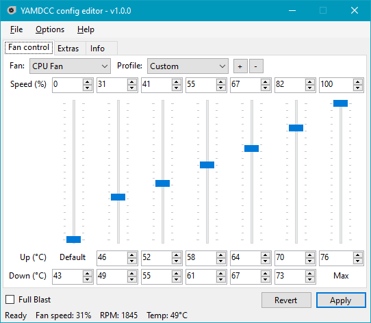
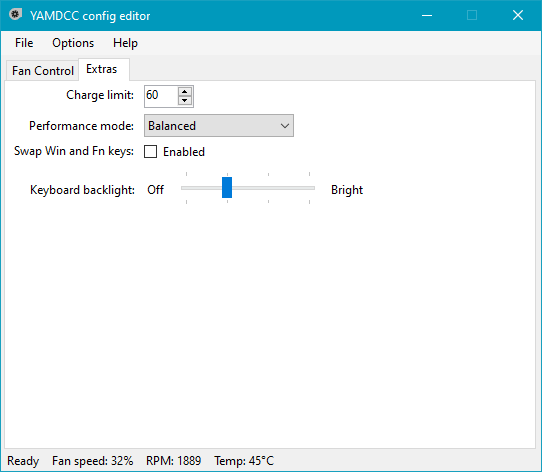

# YAMDCC - Yet Another MSI (Dragon) Center Clone

A fast, lightweight alternative to MSI Center for MSI laptops, written in C#.

**Please read the whole README (or at least the [Supported Laptops](#supported-laptops) and [FAQ](#faq) sections) before downloading.**

## Disclaimers

- While this program is mostly complete, it is still **beta-quality software!**
- While measures are taken to reduce the program crash chance, you may still encounter
  some bugs while using this program.
- This program requires low-level access to some of your computer hardware to apply settings. While
  no issues should arise from this, **I (Sparronator9999) and any other contributers**
  **shall not be held responsible if this program fries your computer.**
- Additionally, if you do something silly with the program like turn off all your fans while
  running under full load, **we *will not* be held responsible for *any* damage you cause to your**
  **own hardware from your use of this program.**
- Linux is not yet supported. Please don't beg me for Linux support, it will come when I can be
  bothered (and when I figure out how to run background services/daemons on Linux).
- This program, repository and its authors are not affiliated with Micro-Star International Co., Ltd. in any way, shape, or form.

## Features

- **Fan control:** Change the fan curves for your CPU and GPU fans, including fan speeds,
  temperature thresholds, and Full Blast (a.k.a. Cooler Boost in MSI Center). This allows you to
  fix a curve that is not aggressive enough under full load, or to turn your fans off when your
  computer is idle.
- **Performance mode:** MSI laptops have their own performance mode setting (not to be confused
  with Windows' built-in power plans). You can change it here.
- **Charging threshold:** This program can limit how much your laptop's battery charges to, which
  can help reduce battery degradation, especially if you leave your laptop plugged in all the time.
- **Lightweight:** YAMDCC only takes up around a megabyte of disk space when installed, and is
  designed to be light on your laptop's CPU.
- **Configurable:** Almost all settings (including those not accessible through the config editor)
  can be changed with the power of XML.

## Screenshots

## Supported Laptops

Currently, there are configs for the following laptops:

  - MSI GF63 Thin 11SC

There are also generic configs that should work with most MSI laptops, but with an incorrect default
config. You can use the EC-to-config feature to get the proper fan curves for your laptop, then
[create a pull request](https://github.com/Sparronator9999/YAMDCC/pulls) to get your laptop's
config added to the project.

Other laptop brands are not officially supported. You can still try and make your own config, but
chances are you're looking for [NoteBook FanControl](https://github.com/UraniumDonut/nbfc-revive)
instead.

### Community tested laptops

The following laptops have been tested by the community and are confirmed to be working:

- MSI Katana GF66 12UG (thanks @porkmanager)
- MSI Vector GP78 HX 13V (thanks @Twisted6)
- MSI Raider GE66 12UGS (thanks @grimy400)
- MSI Vector 17 HX A14VHG (thanks @injitools)
  - Use `MSI-10th-gen-or-newer-nokeylight.xml` - this laptop does not support keyboard backlight
    adjustment via YAMDCC.

### Config disclaimer

**Please avoid asking me (or other people) in the issue tracker to create a config for you.**
**Unless we have your specific laptop model (which we probably don't), we will not be able to**
**help you outside of the general instructions.**

## Comparison

| Feature                         | MSI Center | YAMDCC      |
|---------------------------------|------------|-------------|
| Installed size                  | ~950 MB²   | ~1.05 MB²   |
| Fan control                     | ✔          | ✔           |
| Temp. threshold control         | ❌          | ✔           |
| Multi-fan profile support       | ❌          | ✔           |
| Charge threshold setting        | Limited³   | ✔           |
| Perf. mode setting¹             | ✔          | ✔           |
| Win/Fn key swap¹                | ✔          | ✔           |
| Win key disable                 | ✔          | ❌           |
| Keyboard backlight adjustment¹  | ❌          | ✔           |
| Hardware monitoring             | ✔          | Limited⁴    |
| Other MSI Center features       | ✔          | ❌           |
| Open source                     | ❌          | ✔           |

1: Support for this feature depends on the specific MSI laptop model and YAMDCC support.

2: As of v2.0.38, MSI Center takes about 950 MB of storage space when counting the UWP app (749 MB)
and the files installed on first launch to `C:\Program Files (x86)\MSI` (205 MB). YAMDCC's installed
size is based on the Release build of [commit 1ad9a1f](https://github.com/Sparronator9999/YAMDCC/commit/1ad9a1f),
and includes all unzipped program files, but excludes config XMLs.

3: MSI Center only supports setting the charge threshold to 60%, 80%, or 100%, while YAMDCC can set
this to anything between 0 and 100% (with 0 meaning charge to 100% always).

4: YAMDCC only supports monitoring the CPU/GPU temperatures and fan speeds via EC.

## Roadmap

Below are some changes I would like to make before a 1.0 release of YAMDCC:

- [x] Add auto-rename of computer model to EC-to-config feature.
- [ ] Fix any remaining bugs and QoL features before the 1.0 release.

The following features are currently planned for v1.1:

- [ ] Hotkey support (requested by @grimy400)
  - This will most likely be implemented as a separate background program that listens to keyboard shortcuts,
    since Windows services (or at least those running as Local System) can't "see" keyboard input.
- [ ] *Maybe* CLI support (otherwise this will be in v1.2)
  - Development of a CLI application for YAMDCC has started, but isn't publicly available yet
    - The CLI is missing a *lot* of features, and could do with a rewrite.

Below are some planned features for potential future releases:

- [ ] Support for editing laptop config registers using the GUI/CLI
  - This would allow for creating configs for other laptop brands from the config UI
  - Currently, the only way to do this is to edit the XML directly or use the EC-to-config feature.
- [ ] Plugin system for additional optional features *(needs research)*
- [ ] .NET support
  - Mandatory for Linux support
  - The GUI *should* compile on .NET 8 (and in fact *has* been compiled on .NET 8 before).
  - The Windows service on the other hand... is going to be interesting. Even
    with the `Microsoft.Windows.Compatibility` package installed, I still
    wasn't able to get the service to run without issues.
- [ ] Linux support *(not guaranteed)*
  - Now this would require some figuring out, and may end up being a seperate
    project that's compatible with this project's configs.

## Download

Beta builds are available from [GitHub releases](https://github.com/Sparronator9999/YAMDCC/releases).

Development builds are available through [GitHub Actions](https://github.com/Sparronator9999/YAMDCC/actions).

If you don't have a GitHub account, you can also download the latest development build from
[nightly.link](https://nightly.link/Sparronator9999/YAMDCC/workflows/build/main?preview).

You're probably looking for the `Release` build, unless you're debugging issues with the program.

Alternatively, you can [build the program yourself](#build).

## Build

See also the [wiki page](https://github.com/Sparronator9999/YAMDCC/wiki/Building).

### Using Visual Studio

1.  Install Visual Studio 2022 with the `.NET Desktop Development` workload checked.
2.  Download the code repository, or clone it with `git`.
3.  Extract the downloaded code, if needed.
4.  Open `YAMDCC.sln` in Visual Studio.
5.  Click `Build` > `Build Solution` to build everything.
6.  Your output, assuming default build settings, is located in `YAMDCC.GUI\bin\Debug\net48\`.
7.  ???
8.  Profit!

Make sure to only use matching `yamdccsvc.exe` and `YAMDCC.exe` together, otherwise you
may encounter issues (that means `net stop yamdccsvc` first, then compile).

### From the command line

1.  Follow steps 1-3 above to install Visual Studio and download the code.
2.  Open `Developer Command Prompt for VS 2022` and `cd` to your project directory.
3.  Run `msbuild /t:restore` to restore the solution, including NuGet packages.
4.  Run `msbuild YAMDCC.sln /p:platform="Any CPU" /p:configuration="Debug"` to build
    the project, substituting `Debug` with `Release` (or `Any CPU` with `x86` or `x64`)
    if you want a release build instead.
5.  Your output should be located in `YAMDCC.GUI\bin\Debug\net48\`, assuming you built
    with the above unmodified command.
6.  ???
7.  Profit!

## Issues

If your question isn't already answered in the [FAQ](#faq) or [issues megathread](https://github.com/Sparronator9999/YAMDCC/issues/1),
and there isn't already another similar issue in [the issue tracker](https://github.com/Sparronator9999/YAMDCC/issues),
feel free to open an issue. Please make sure to use the correct issue template for your problem.

## Contributing

See the [build instructions](#build) to build this project.

If you would like to contribute to the project with bug fixes, new features,
or new configs, feel free to open a pull request. Please include the following:

- **Bug Fixes/Improvements:** Describe the changes you made and why they
  are important or useful.
- **New Config:** Add a config with your laptop's default fan profile so that
  other people don't have to run the EC-to-config tool.

## FAQ

### What versions of Windows do you support?

Windows 10 and 11 (64-bit).

32-bit Windows 10 should also work, but you really should be using 64-bit Windows in 2024.

Older versions of Windows that support .NET Framework 4.8 may also work, but with no support from me.

### Can you please make a Linux version?

Soon™.

Use one of the [many](https://github.com/dmitry-s93/MControlCenter) [other](https://github.com/gourav1100/isw)
[projects](https://github.com/YoCodingMonster/OpenFreezeCenter) on GitHub instead while you wait.

### How does this program work?

YAMDCC works by accessing your laptop's embedded controller (aka, the EC). Many settings that
can be configured with MSI Center are stored here, including fan curve, performance mode,
and the Win/Fn key swap setting.

### Why do I need administrator privileges to run this program?

1. Because admin privileges are required to install kernel drivers, and...

2. For security reasons, only programs with admin privileges are allowed to communicate with the
YAMDCC service once it's running.

### Why does this program need a kernel driver?

Because communicating with the EC requires low-level hardware access, something only possible from
within the kernel. This program achieves this with [WinRing0](https://github.com/GermanAizek/WinRing0).

### Doesn't WinRing0 have security issues?

[Yes](https://voidsec.com/crucial-mod-utility-lpe-cve-2021-41285/), however YAMDCC mitigates this
by installing the driver such that only programs run with administrator privileges can communicate
with the driver.

Why wasn't this done by the driver itself in the first place, you might ask? Honestly, I don't know
how this slipped through during development, but here we are. Unfortunately the
[updated fork of WinRing0](https://github.com/GermanAizek/WinRing0) that *does* fix this
vulnerability driver-side doesn't have a binary release due to Microsoft's strict driver signing
requirements.

NOTE:
If YAMDCC finds the driver already installed, it may try to use that (potentially vulnerable)
driver instead. If it was installed with, e.g. [LibreHardwareMonitor](https://github.com/LibreHardwareMonitor/LibreHardwareMonitor),
you should be fine, as they implement the same workaround that YAMDCC does.

Please read the [disclaimer](#disclaimers), especially the bold text, if you haven't already.

### Help! My fan profiles aren't being applied!

You may need to disable virtualisation-based security (VBS). See
[this page](https://www.thewindowsclub.com/disable-vbs-windows) for more info,
but generally this boils down to disabling a Windows Defender feature (Memory
integrity), and/or uninstalling virtualisation features (Hyper-V, WSL, etc.)

A warning may be added in the future to YAMDCC if VBS is enabled once more
information is available on what settings break YAMDCC (and related software,
e.g. ThrottleStop)

If the above steps don't fix your problem, search the [issue tracker](https://github.com/Sparronator9999/YAMDCC/issues)
for similar issues, or [open a new issue](https://github.com/Sparronator9999/YAMDCC/issues/new)
if a similar issue doesn't already exist (see the [Issues section](#issues) of the README).

### My laptop isn't supported! What do I do?

[See above](#supported-laptops).

### Can you write a config for my laptop?

Again, [see above](#supported-laptops).

### Help! My laptop stopped booting/is doing weird stuff!

Reset your EC (MSI laptops only):

Shut down the laptop if it's on (force shut down if needed), then find the EC reset button
(on the GF63 Thin 11SC, it's a small hole located on the bottom of the laptop next to the charge port)
and press it with the end of a paperclip, SIM ejector, or similarly small tool for at least 5 seconds,
then try rebooting.

If the issue persists, try disconnecting all power sources, including the laptop's CMOS/clock
battery and "main" battery (requires disassembly of laptop). Leave disconnected for a few seconds,
then re-connect everything, re-assemble and attempt a reboot. This will reset your BIOS settings.

Users of other laptop brands will need to look up instructions for their laptop.

### Dark mode?

Due to WinForms limitations, no.

Technical explanation: A few specific WinForms controls used by YAMDCC look really bad
when trying to recolour them to be dark themed. Also, built-in dialog boxes (for C# programmers,
think `MessageBox.Show`) cannot be recoloured from their default white theme. Also, I have little
to no experience with other UI kits (e.g. WPF).

### Why are you still using WinForms in 2024?

Because it's what I know (thanks, my high school programming classes).

I've tried WPF before, but without much success (although I might look into it more once I find a
suitable replacement for some WinForms controls missing in WPF, and get some more WPF experience).

### .NET (Core) 5/6/8/<insert latest .NET version>!

Probably not for Windows (unless it goes EOL, which I doubt will happen for a while).

If Linux support ever comes, it will be using .NET (since .NET Framework isn't supported on Linux).

## License and Copyright

Copyright © 2023-2024 Sparronator9999.

This program is free software: you can redistribute it and/or modify it under
the terms of the GNU General Public License as published by the Free Software
Foundation, either version 3 of the License, or (at your option) any later
version.

This program is distributed in the hope that it will be useful, but WITHOUT ANY
WARRANTY; without even the implied warranty of MERCHANTABILITY or FITNESS FOR A
PARTICULAR PURPOSE. See the [GNU General Public License](LICENSE.md) for more
details.

## Third-party Libraries

This project makes use of the following third-party libraries:

- [My fork of Named Pipe Wrapper](https://github.com/Sparronator9999/NamedPipeWrapper) for
  communication between the service and UI program (called `YAMDCC.IPC` in the source files).
- [WinRing0](https://github.com/QCute/WinRing0) for low-level hardware access required to
  read/write the EC.
